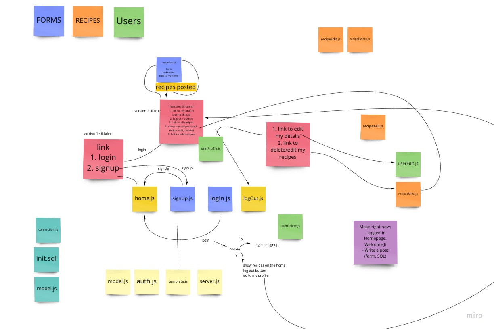
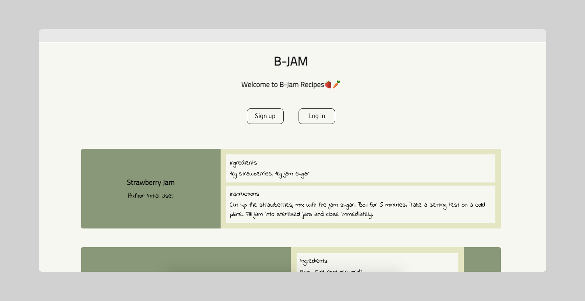
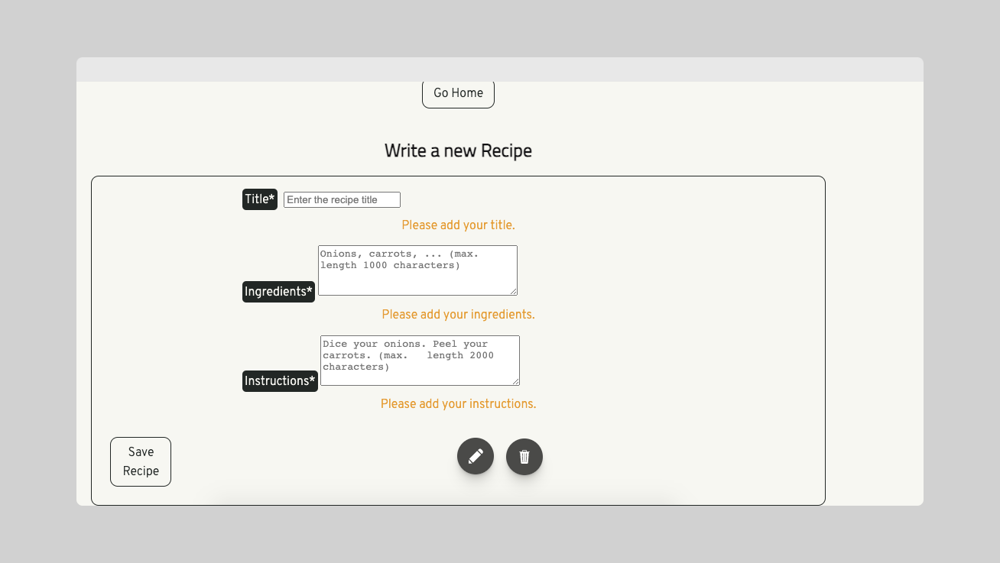
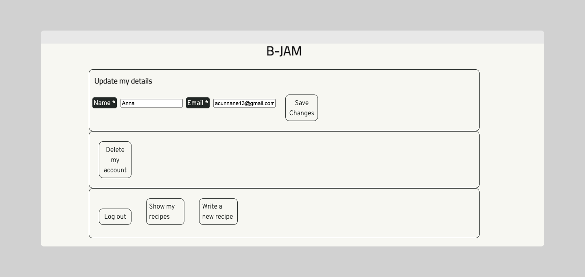

# B-JAM recipe board 🍜

Add your favourite recipes with B-JAM 🍽

[`Deployed version here`](https://week4-abjm.herokuapp.com/)

### Instructions for how to run locally

1. Clone the repo
2. cd into the folder and run `NPM install`
3. Run the scripts > create_db and populate_db to initialise the local copy of the database

### Roles 👥

UX - Ji

Facilitator - Anna

DevOps - Michael

QA - Barbara

### Core User Stories 📖

As a user 🙎‍♀️ I want to...

- Login to the app, update my details and delete my data
- Post my recipes
- Come back later and see that my recipes are still there
- Delete my recipe
- See everybody's recipes

### Acceptance Criteria ✅

✔️ Express server 🚀

✔️ Postgres database

✔️ Hosted on Heroku

✔️ Using of the spike topics (file upload 📂 )

✔️ Validated user-submitted data on the server

✔️ Form validation in the browser

✔️ Error handling informing the user of what went wrong 😮

✔️ CSS styling

✔️ Acccessibility testing

✔️ Cypress testing on most routes 🌲

Future improvements 🕰

- Fix image avatar upload feature 🏙
- Tests 🧪 for all routes
- GitHub Actions CI setup to run tests when we push
- Future features:

  📍 commenting on recipes

  📍 'like' buttons on recipes ❤️

  📍 image uploads on recipes

### App User Flow

### What we learnt 📚

- How to implement file uploads in Node.js with Multer
- How to validate user input in the client and on the server 👍
- How to use Express middleware and how to write our own middleware functions to organise our code.

### Bugs we ran into 🐛

- We had an issue with our avatar images not showing on the page. This was due to a syntax error in the SQL query.
- We noticed that a user had to log in again after they signed-up to post a recipe. This was due to a missing return statement in the `createUser` function.

### Screenshots 👀

